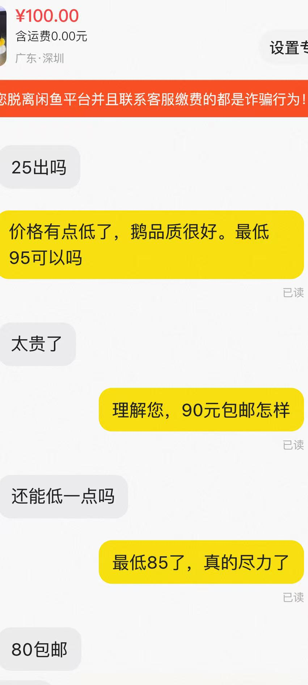
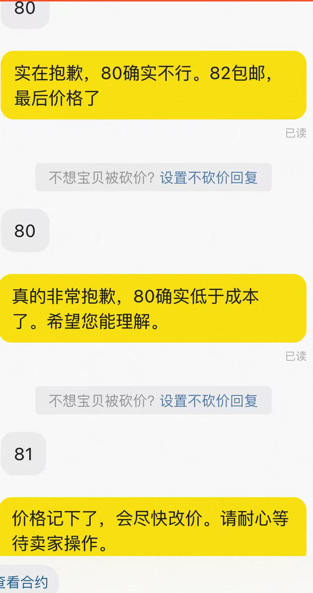

# xianyu-agent

基于 **Pi 架构**重构的闲鱼智能客服 Agent。项目通过闲鱼长连接接收买家消息，由 Agent 自主完成意图判断、工具调用、上下文整理和回复发送，适合需要自动值守闲鱼店铺的场景。

## 项目特点

- **Pi 风格 Agent 循环**：模型按“理解上下文 → 调用工具 → 读取结果 → 继续决策”的循环工作，工具结果以结构化消息回到上下文。
- **分层架构**：传输层、Agent 内核、工具层和能力层单向依赖，闲鱼通道与模型决策相互独立。
- **规则优先的意图路由**：先用规则处理高频请求，再使用模型兜底，支持议价、技术咨询、默认客服和无需回复四类路径。
- **领域工具调用**：可查询商品信息、读取历史消息、记录议价轮次、进行联网搜索，并在需要人工处理时发送通知。
- **会话级并发控制**：不同会话异步并发，同一会话严格串行，避免消息交错；单条消息带轮次上限和超时控制。
- **可持续的会话记忆**：SQLite 保存消息、商品缓存和会话画像，JSONL 快照记录每次 Agent 决策现场。
- **闲鱼通道能力**：支持 token 刷新、心跳保活、断线重连、人工接管和拟人化输入延迟。

## 实际对话

闲鱼实际议价对话，按顺序展示：

<p>
  
  
</p>

## 架构概览

```text
闲鱼长连接 / 终端调试
          │
          ▼
   channel.py / cli.py
          │ 事件
          ▼
     Agent 内核
 agent.py · router.py · llm.py · types.py
          │ 工具注册表
          ▼
 tools.py · kf_tools.py
          │
          ▼
 store.py · xianyu_api.py · session.py
```

Pi 重构的核心边界：`agent.py` 只负责决策循环，工具通过显式注册表注入；`channel.py` 只负责接收和发送事件；`SessionRegistry` 负责会话串行、超时、中断以及唯一发送出口。

## 快速开始

### 1. 安装

要求 Python 3.10 或更高版本。

```bash
git clone https://github.com/Hddcc/xianyu-agent.git
cd xianyu-agent
python -m venv .venv

# Linux / macOS
source .venv/bin/activate

# Windows PowerShell
# .\\.venv\\Scripts\\Activate.ps1

python -m pip install -r requirements.txt
```

### 2. 配置环境变量

复制模板并填写模型 API 和闲鱼 Cookie：

```bash
cp .env.example .env
```

```dotenv
API_KEY=你的模型API_KEY
MODEL_BASE_URL=https://dashscope.aliyuncs.com/compatible-mode/v1
MODEL_NAME=qwen-max
COOKIES_STR=你的闲鱼网页端完整Cookie
```

模型接口采用 OpenAI 兼容格式，可替换为其他兼容服务。`CLASSIFY_MODEL_NAME` 可以单独指定意图分类模型；留空时沿用 `MODEL_NAME`。需要技术联网搜索时保持 `ENABLE_SEARCH=True`。

闲鱼 Cookie 获取步骤：登录 [闲鱼网页版](https://www.goofish.com) 后打开“消息”，在浏览器开发者工具的 Network → Fetch/XHR 中找到 `h5api.m.goofish.com` 请求，复制完整 Cookie 到 `COOKIES_STR`。Cookie 中需要包含 `unb`、`_m_h5_tk` 等字段。

议价规则在 `.env` 中配置，对所有商品和专家角色统一生效：

```dotenv
BARGAIN_ENABLED=True
BARGAIN_MAX_DISCOUNT_PERCENT=10
```

`BARGAIN_MAX_DISCOUNT_PERCENT` 设置所有商品的累计最大砍价百分比，默认 `10`，取值范围为 `0` 到 `100`。程序按议价轮次逐步放宽：首轮开放总上限的一半，第二轮开放四分之三，第三轮起开放完整上限；例如标价 1000 元、上限 10% 时，阶段最低价依次为 950、925、900 元。每个商品都按本次读取的最新标价计算，历史报价不会覆盖当前规则。`BARGAIN_ENABLED=False` 表示一口价。`FLOOR_NOTE` 保留为补充话术要求，硬性优惠限制请使用上述百分比配置。旧配置中的 `BARGAIN_MIN_PRICE` 已移除，可从 `.env` 删除。

每次处理买家消息时重新读取平台商品信息。带数字的价格消息会要求模型优先调用 `quote_price`，工具会校验当前阶段的报价范围；超出阶段范围时返回可执行的当前最低价，避免直接发送未经校验的金额。改价通知同样校验成交金额。价格读取失败或规格价格不一致时，暂停自动报价，由卖家确认。通道对短时间内重复推送的同一消息做去重，修改配置后需重启进程。

`.env`、运行数据、密钥文件和其他 Markdown 文档已加入 Git 忽略规则，提交时仅保留本 README 作为项目说明。

### 3. 先运行终端调试

终端调试不会连接闲鱼，适合先验证模型、路由和工具链路：

```bash
python -m xianyu_agent.cli --dev
```

输入买家消息即可查看 Agent 回复。需要查询真实商品时，可以在 `.env` 中设置 `DEV_ITEM_ID`。

### 4. 启动闲鱼值守

确认调试模式可用后启动正式值守：

```bash
python -m xianyu_agent.cli
```

启动流程会自动完成 token 获取、长连接建立、心跳保活和 token 刷新。也可以先检查 Cookie 与 token：

```bash
python -m xianyu_agent.cli --check
```

### 5. Docker 启动（可选）

```bash
cp .env.example .env
# 编辑 .env 后执行
docker compose up -d
docker compose logs -f
```

容器将 `data/` 挂载到宿主机，用于保留 SQLite 数据和会话快照。

修改 `.env` 后执行 `docker compose up -d --force-recreate` 以重新加载环境变量；更新代码后执行 `docker compose up -d --build`。

### 6. 运行测试

```bash
python -m pytest tests/ -q
```
